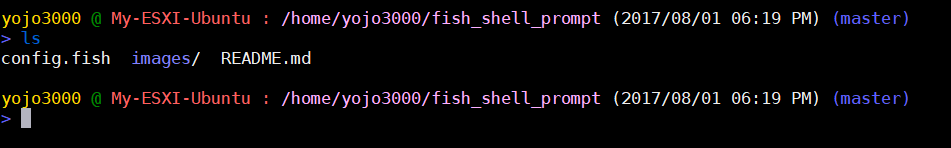

#### Installation:
```
git clone https://github.com/yojo3000/fish_shell_prompt.git ~/fish_shell_prompt; \
sh ~/fish_shell_prompt/install.sh; \
source ~/.config/fish/config.fish;
```



#### System Info:
```
infosys
```

#### Git Alias:
git logs:
```
git config --global alias.logs "log --graph --abbrev-commit --decorate --date=relative --all"
```

#### Docker Alias:
```
alias drm="docker rm -f (docker ps -a -q)"
alias di="docker images"
alias dp="docker ps"
alias dpa=docker_ps_format_running (self defined function)
alias dpaexit=docker_ps_format_exit (self defined function)
alias drmnone="docker rmi (docker images --filter "dangling=true" -q --no-trunc)"
alias drmexit="docker ps -a | grep Exit | cut -d ' ' -f 1 | xargs docker rm"
```

### Docker tags search:
```
dtag "image_name
```
